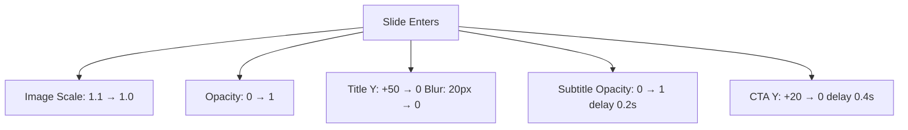

# Genz Bold Hero Carousel - Implementation Plan

## Overview
Transform the existing hero carousels on both mobile and web platforms into a unified, high-energy "crazy modern Genz bold" carousel experience using the 5 attached design PNGs.

## Target Platforms
- **Mobile**: React Native (Expo) - [`mobile/src/components/home/HeroCarousel.tsx`](mobile/src/components/home/HeroCarousel.tsx)
- **Web**: Next.js - [`web/src/components/home/HeroFuture.tsx`](web/src/components/home/HeroFuture.tsx)

## Source Assets (5 Carousel Designs)
Located in [`mobile/assets/carousel/`](mobile/assets/carousel):
1. `slide-1-streetwear.png` - Streetwear aesthetic
2. `slide-2-product.png` - Product-focused design
3. `slide-3-vision.png` - Vision/branding focused
4. `slide-4-history.png` - Brand heritage content
5. `slide-5-service.png` - Service/promotion focus

## Design System

### Color Palette (Unified)
```typescript
const CAROUSEL_COLORS = {
  neonCherry: '#E31C79',
  neonLime: '#CCFF00', 
  neonCyan: '#00F0FF',
  neonPink: '#FF00FF',
  darkBackground: '#0A0A0A',
  white: '#FFFFFF'
};
```

### Typography (Genz Bold Style)
- **Mobile**: System fonts with heavy weights (900), tight tracking
- **Web**: Inter/sans-serif with font-black, tracking-tighter

### Animation Philosophy
- High energy, physics-based
- Smooth transitions with spring animations
- Parallax depth effects
- Neon glow accents

## Architecture

```
shared/
├── types/
│   └── carousel.ts          # Shared carousel type definitions
├── hooks/
│   └── useCarousel.ts       # Shared carousel logic
└── constants/
    └── carouselAssets.ts    # Asset paths for both platforms

mobile/
├── src/
│   ├── components/
│   │   └── home/
│   │       └── HeroCarousel.tsx  # Redesigned with Reanimated
│   └── hooks/
│       └── useMobileCarousel.ts   # Mobile-specific carousel hook

web/
├── src/
│   ├── components/
│   │   └── home/
│   │       └── HeroFuture.tsx     # Redesigned with Framer Motion
│   └── hooks/
│       └── useWebCarousel.ts      # Web-specific carousel hook
```

## Implementation Steps

### Step 1: Shared Types & Assets Configuration
Create [`shared/types/carousel.ts`](shared/types/carousel.ts):
```typescript
export interface CarouselSlide {
  id: string;
  title: string;
  subtitle: string;
  description?: string;
  imagePath: string;
  ctaText?: string;
  ctaLink?: string;
  accentColor: string;
  neonGlowColor: string;
}

export const CAROUSEL_SLIDES: CarouselSlide[] = [
  {
    id: 'streetwear',
    title: 'STREETWEAR',
    subtitle: 'DROP 01 // 2026',
    description: 'Urban apocalypse ready. Technical fabrics meet street culture.',
    imagePath: require('../../mobile/assets/carousel/slide-1-streetwear.png'),
    ctaText: 'SHOP NOW',
    accentColor: '#E31C79',
    neonGlowColor: '#FF69B4'
  },
  // ... add all 5 slides
];
```

### Step 2: Mobile HeroCarousel Redesign

**Key Features:**
- [`react-native-reanimated`](https://docs.swmansion.com/react-native-reanimated/) for smooth animations
- Pan gesture handler for swipe navigation
- Parallax image effect
- Animated progress bar
- Neon glow overlays

**Component Structure:**
```tsx
// mobile/src/components/home/HeroCarousel.tsx
export function HeroCarousel() {
  const scrollX = useSharedValue(0);
  const { width } = useWindowDimensions();
  
  return (
    <View style={{ height: 320 }}>
      <Animated.ScrollView
        horizontal
        pagingEnabled
        showsHorizontalScrollIndicator={false}
        onScroll={scrollX}
        scrollEventThrottle={16}
      >
        {CAROUSEL_SLIDES.map((slide, index) => (
          <CarouselSlideComponent 
            slide={slide} 
            index={index}
            scrollX={scrollX}
          />
        ))}
      </Animated.ScrollView>
      
      {/* Animated pagination dots */}
      <PaginationDots scrollX={scrollX} count={CAROUSEL_SLIDES.length} />
      
      {/* Progress bar */}
      <ProgressBar scrollX={scrollX} duration={5000} />
    </View>
  );
}
```

**Animations to Implement:**
1. Slide entrance: Scale + fade in
2. Image parallax on scroll
3. Text reveal with blur-out effect
4. Neon glow pulse on active slide
5. Smooth progress bar fill

### Step 3: Web HeroFuture Redesign

**Key Features:**
- Framer Motion for complex animations
- Scroll parallax effect
- Drag/swipe gestures
- Keyboard navigation (arrow keys)
- Progress bar with smooth transitions

**Component Structure:**
```tsx
// web/src/components/home/HeroFuture.tsx
export function HeroFuture() {
  const [currentSlide, setCurrentSlide] = useState(0);
  
  return (
    <motion.div 
      className="relative h-screen w-full overflow-hidden bg-black"
      initial={{ opacity: 0 }}
      animate={{ opacity: 1 }}
    >
      <AnimatePresence mode="wait">
        <CarouselSlide 
          key={currentSlide}
          slide={CAROUSEL_SLIDES[currentSlide]}
          onSlideChange={setCurrentSlide}
        />
      </AnimatePresence>
      
      {/* Controls */}
      <SlideNavigation 
        slides={CAROUSEL_SLIDES}
        currentIndex={currentSlide}
        onSelect={setCurrentSlide}
      />
    </motion.div>
  );
}
```

### Step 4: Shared Components

#### 4.1 CarouselSlide Component
Unified slide component that adapts to platform:
- Platform-specific image handling
- Consistent typography and layout
- Platform-specific animation libraries

#### 4.2 Pagination Indicators
- Mobile: Animated dots with scale effect
- Web: Numbered indicators with progress ring

#### 4.3 Progress Bar
- Mobile: Linear with animated width
- Web: Timeline-style with slide counter

### Step 5: Animation Specifications

#### Entrance Animations


#### Transition Animations
- **Slide Transition**: Slide out left with fade, slide in from right
- **Crossfade**: Smooth opacity crossfade with scale effect
- **Parallax**: Background moves slower than foreground content

#### Neon Glow Effects
- CSS box-shadow for web
- ShadowProps for React Native
- Animated glow intensity on active slide

## File Changes Summary

| File | Change |
|------|--------|
| `shared/types/carousel.ts` | New - Shared type definitions |
| `shared/constants/carouselAssets.ts` | New - Asset path configuration |
| `mobile/src/components/home/HeroCarousel.tsx` | Rewrite with Reanimated |
| `web/src/components/home/HeroFuture.tsx` | Rewrite with enhanced Framer Motion |
| `mobile/src/hooks/useMobileCarousel.ts` | New - Mobile carousel logic |
| `web/src/hooks/useWebCarousel.ts` | New - Web carousel logic |

## Testing Checklist
- [ ] Auto-advance slides every 5 seconds
- [ ] Manual swipe/tap navigation works
- [ ] Progress bar syncs with timing
- [ ] All 5 images load correctly
- [ ] Animations are smooth (60fps)
- [ ] Responsive layout on different screen sizes
- [ ] Dark mode compatibility
- [ ] Accessibility (aria-labels, keyboard nav)

## Success Metrics
- Smooth scroll performance (no jank)
- Engaging user interaction
- Brand-consistent visual identity
- Cross-platform consistency
