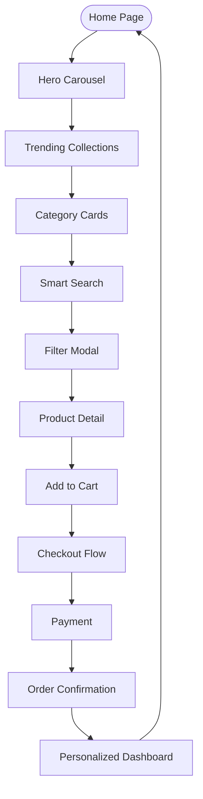

# RIIQX E-Commerce Transformation Plan

## Overview
Transform RIIQX into a modern, elegant, mobile-first e-commerce experience with premium design, intuitive UX, and high conversion optimization. The redesign covers both the Next.js web app and React Native mobile app, incorporating the specified brand identity, UI/UX improvements, and new features.

## Brand Visual Identity
- **Colors**: Primary #1F1F1F (Rich Black), #FFFFFF (White); Accent #E31C79 (Cherry Red), #F5C518 (Gold); Neutrals #F7F7F7, #CCCCCC
- **Typography**: Headings - Playfair Display / Inter Bold; Body - Inter Regular; UI Labels & Buttons - Inter SemiBold
- **Iconography**: Minimal line icons with accent fill on hover/active
- **Imagery**: Full-bleed lifestyle banners, consistent product photo aspect ratios, high-contrast shadows

## Todo List
- [ ] Implement Brand Visual Identity (colors, typography, iconography) for web and mobile apps
- [ ] Redesign Home/Discover Page (hero carousel, trending collections, categories, CTAs) for web and mobile
- [ ] Develop Smart Search & Filters (predictive search, filter modal, instant updates) for web and mobile
- [ ] Redesign Product Detail Page (sticky elements, image carousel, add-to-cart, reviews) for web and mobile
- [ ] Simplify Cart & Checkout Flow (progress indicators, payment options, trusted icons) for web and mobile
- [ ] Add Personalized UX (recommended, recently viewed, wishlist highlights) for web and mobile
- [ ] Create New Sections (Lookbook, Limited Edition Drops, Community Showcase) for web and mobile
- [ ] Implement Mobile-First Navigation (bottom nav for mobile, sticky header for web) for web and mobile
- [ ] Apply Visual UI/UX Improvements (consistent grids, larger buttons, font hierarchy) for web and mobile
- [ ] Integrate Interaction & Micro-Animations (hover effects, smooth transitions, auto-scroll) for web and mobile
- [ ] Update Tech Stack and Dependencies (Tailwind, Framer Motion, component library) for web and mobile

## System Architecture
```mermaid
graph TD
    A[User] --> B[Web App (Next.js)]
    A --> C[Mobile App (React Native)]
    B --> D[Supabase]
    C --> D
    B --> E[Shopify API]
    C --> E
    D --> F[Database]
    E --> G[Product Data]
    B --> H[Stripe/Razorpay]
    C --> H
```

## User Flow Diagram


## Implementation Notes
- **UI Technologies**: Tailwind CSS / Styled Components, Next.js + React, Framer Motion / Lottie for animations
- **Responsive Grid System**: Ensure mobile-first design
- **Component Library**: Design system tokens for colors, spacing, typography; reusable components (Buttons, Cards, Modals)
- **Data & Backend**: SEO-optimized product schema, API for filters & search
- **Payment**: Integrate GPay, PhonePe, Razorpay, Cards with trusted icons

This plan provides a structured approach to transforming RIIQX. Each todo item will be executed sequentially, starting with brand identity updates and progressing through UI/UX enhancements.